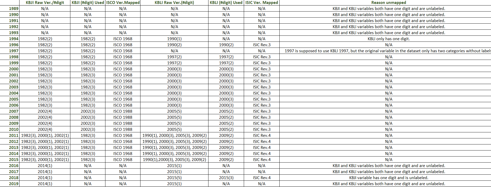
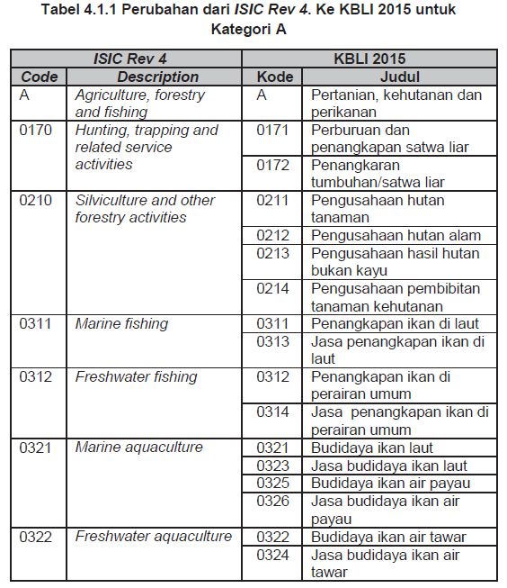
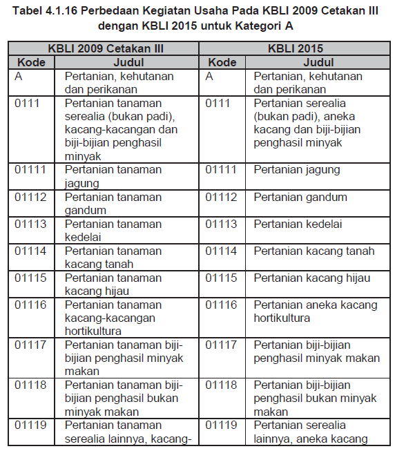

# Correspondences between national and international classifications

This document describes the methodology used to map national industrial and occupational codes to their international counterparts. For industry, five versions of national classification, *Klasifikasi Baku Lapangan Usaha Indonesia (KBLI)*, were mapped to two versions of *International Standard Industrial Classification of all Economic Activities (ISIC)*; regarding occupation, two versions of national classification, *Klasifikasi Baku Jenis Pekerjaan Indonesia (KBJI)*, were mapped to two versions of *International Standard Classification of Occupations (ISCO)*. Specific versions mapped for each year harmonized are summarized in the table below along with internal links to the docs.

| **Version of KBJI**	| **Corresponding ISCO**	| 
| :-----------------------:	| :-------:	| 
| [1982](utilities/KBLI-1982)  | ISCO 1968| 
| [2002](utilities/KBLI-2002)  | ISCO 1988| 

|**Version of KBLI**	| **Corresponding ISIC**	|
| :-----------------: |:-----------------------:|	 	 
| [1997](utilities/KBLI-1997) | ISIC Rev.3| 
| [2000](utilities/KBLI-2000) | ISIC Rev.3|
| [2005](utilities/KBLI-2005) | ISIC Rev.3|
| [2009](utilities/KBLI-2009) | ISIC Rev.4|
| [2015](utilities/KBLI-2015) | ISIC Rev.4|

In general, we only mapped 1994-2018 as earlier years like 1989-1993 do not have two-digit industrial or occupational codes; and recent year, 2019, only has one-digit variables which directly corresponds to the top level of ISIC/ISCO.

*(We will update this documentation along with IDN GLD if we get more information on correspondence tables for KBJI and KBLI in the future. Please feel free to contact the GLD focal point (gld@worldbank.org) if you know anything that might help map Indonesia's industrial or occupational codes. Thanks!)*

## Correspondence in industry classification

**KBLI 2000 to ISIC Rev.3**

**KBLI 2005 to ISIC Rev.3**

The KBLI-2005 document is in Indonesian but it compares not only between KBLI 2005 and ISIC Rev.3 but also between KBLI-2005 and KBLI-2009. KBLI-2005 has the same structure as ISIC Rev.3, which has 15 major groups. The differences between KBLI-2005 and ISIC Rev.3 at two-digit level are very minor. Here is a short list showing the differences when mapping at two-digit level. The full correspondence table is [here](utilities/Industry correspondences.xlsx) with an English version of KBLI-2005 translated by online software.

| **KBLI-2005 Code**	| **KBLI-2005 Industry**	| **ISIC Rev.3 Code**	| **ISIC Rev.3 Industry**	|
| :-----------------------:	| :---------------------------:	| :-------------:|:----------------:|	 	
| 52 | Retail trade, except cars and motorcycles             | 52 |  Retail trade, except of motor vehicles and motorcycles; repair of personal and household goods |
| 53 | Export trade, except for trade in cars and motorcycles| 52 |  Retail trade, except of motor vehicles and motorcycles; repair of personal and household goods |
| 54 | Import trade, except car and motorcycle trade         | 52 |  Retail trade, except of motor vehicles and motorcycles; repair of personal and household goods|
| 00 | Activities that has no clear boundaries               | -  |  (Coded missing)|

**KBLI 2009 & KBLI 2015 to ISIC Rev.4**

The KBLI-2015 document in the summary table above is only available in Indonesian. But it has a complete correspondence table with ISIC Rev.4 showing all the differences (see the picture below) and another one compared to KBLI-2009 from which KBLI-2015 was adapted. Here are the differences between the two classifications.

**Example of the correspondence between KBLI-2015 and ISIC Rev.4**

**Example of the correspondence between KBLI-2015 and KBLI-2009**

The structure of KBLI-2015 is almost the same as KBLI-2009 and ISIC Rev.4. As being described in the documentation attached above: 

>Klasifikasi KBLI 2015 terdiri dari struktur pengklasifikasian aktivitas ekonomi yang konsisten dan saling berhubungan, didasarkan pada konsep, definisi, prinsip, dan tatacara pengklasifikasian yang telah disepakati secara internasional. Struktur klasifikasi menunjukkan format standar untuk mengelola informasi rinci tentang keadaan ekonomi, sesuai prinsip-prinsip dan persepsi ekonomi.

>Secara umum, baik KBLI 2015 dan KBLI 2009 Cetakan III masih mengacu pada rujukan yang sama yaitu ISIC Rev. 4 yang terdiri dari 21 kategori. Perubahan struktur berupa pergeseran atau pengelompokkan suatu kegiatan dari satu klasifikasi ke klasifikasi lainnya, dan penambahan klasifikasi baru yang disebabkan adanya perkembangan aktivitas ekonomi, memungkinkan untuk terbentuknya kelompok yang berdiri sendiri atau digabungkan dengan kategori lain yang lebih sesuai.

Translated by online software as:

>The 2015 KBLI classification consists of a classification structure consistent and interconnected with economic activity, based on concepts, definitions, principles, and classification procedures that has been agreed internationally. Classification structure shows standard format for managing detailed information about the state economy, according to economic principles and perceptions.

>In general, both KBLI-2015 and KBLI-2009 (ver. III) still refers to the same reference, namely ISIC Rev.4 which consists of 21 categories. Changes happened in the form of shifts or grouping an activity from one classification to another.    

**Categories and Groupings of KBLI-2015**

| **Structure of KBLI-15**	| **Digit**	| **Quantity**	|
| :-----------------------:	| :-------:	| :-------------:	 	
| Category  | Alphabet        | 21|  
| Main Group  | 2-digit        | 88 |  
| Group  | 3-digit       | 240   |  
| Subgroup | 4-digit        | 520|  
| Group | 5-digit        | 1573  |  

Balancing between the level of precision and difficulty of mapping, we mapped KBLI-2015 to ISIC at a three-digit level, as the differences at three-digit level can be easily located and manually recoded. The table below shows all the differences between KBLI-2015 and ISIC, and those between KBLI-2009 and ISIC. When mapping KBLI to ISIC, for example, KBLI code 073 will be coded as ISIC 072.  

| **ISIC Rev.4**	| **KBLI 2015**	| **KBLI 2009**	|
| :-----------------------:	| :-------:	| :-------------:|	 	
| 072-Mining of non-ferrous metal ores|073-Pertambangan bijih logam|073-Pertambangan bijih logam |  
| 492-Other land transport|494-Angkutan darat bukan |494-Angkutan Darat Bukan Bus|
| 5520-Camping grounds, recreational vehicle, parks and trailer parks|5519-Penyediaan akomodasi|5519-Penyediaan akomodasi|
| 552-Provision of accommodation in campgrounds, trailer parks, recreational camps and fishing and hunting camps for short stay visitors| (Same as ISIC) |551-Penyediaan Akomodasi Jangka Pendek|  
| 851-Early childhood education and basic education services | (Same as ISIC) |856-Jasa Pendidikan Anak Usia Dini|  
| 960-Other personal service activities |961-Aktivitas jasa perorangan|961-Jasa Perorangan Untuk Kebugaran, Bukan Olahraga|  
| 960-Other personal service activities |962-Aktivitas binatu | 962-Jasa Binatu |
| 960-Other personal service activities |969-Aktivitas jasa perorangan lainnya YTDL |969-Jasa Perorangan Lainnya Ytdl|

