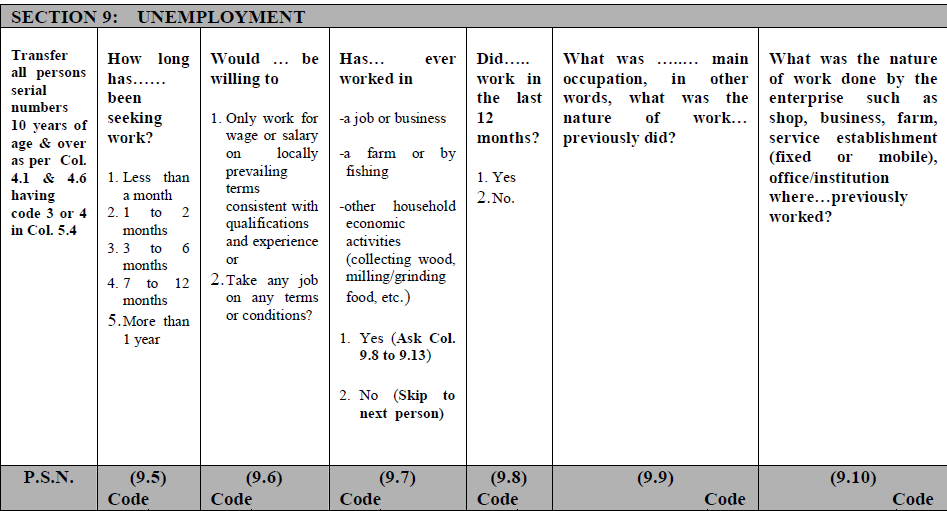
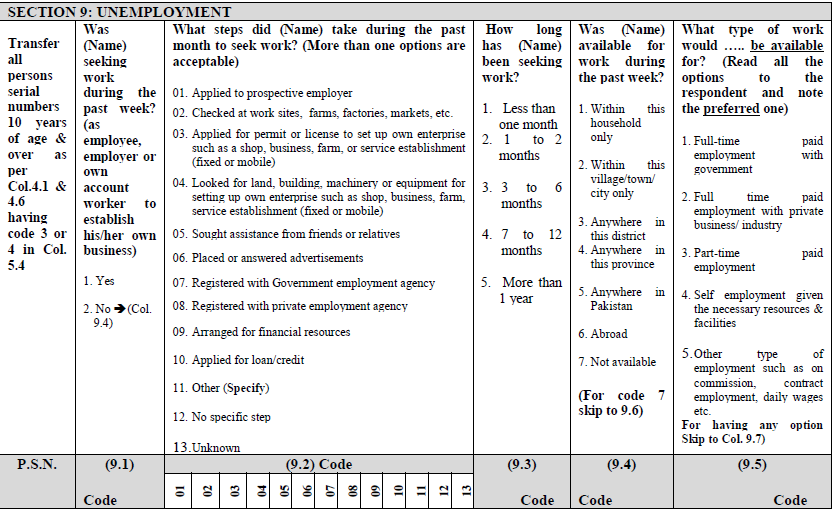
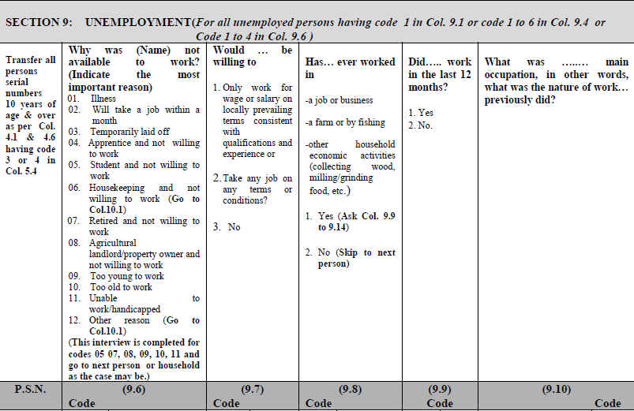
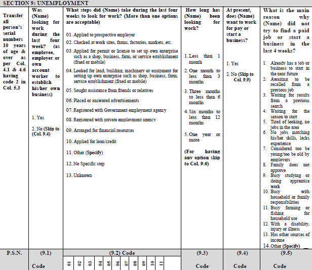
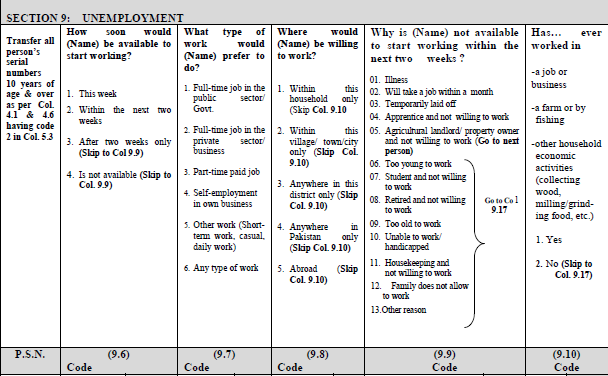
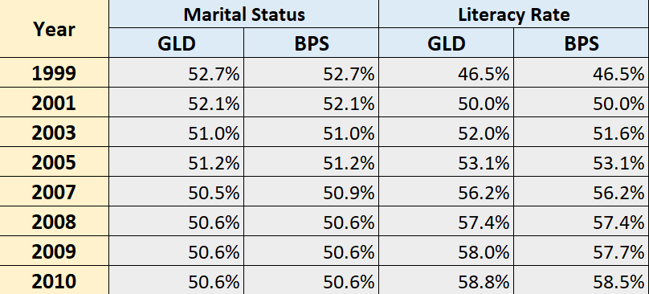

# Labor status and labor force participation rate

This document shows the details of coding `lstatus` for different years whose labor questions are structured in different ways. 


## Employed Population

The way of coding **employed** population is consistent for all years. The definition of being employed from the BPS for all years is:  


And here is an example of employment question section from the questionnaire of 2012: 


Following BPS's definition, we used questions from 5.1 to 5.4 to code `lstatus==1`, or the employed. We define that anyone answering either one of the following options as being employed: 
```
1.Being employed was the principal activity during most of the last 12 months or
2.Did some work for pay, profit or family gain during last week, as least for one hour one day or
3.Helped to work for family gain in a family business or family farm during last week or
4.Had a job or enterprise such as a shop, business, farm or service establishment(fixed or mobile)
```


Compared to coding "employed", coding "unemployed" varies across years due to changes of the questions of the unemployment section as well as the order of them. Whether a given respondent is **seeking a job** and whether the respondent is **available for work** are two important elements of defining unemployed population and potential labor force. Sub-sections below focus on questions concerning "seeking a job" and availability and changes of these questions over years.

We define being unemployed is 1) not have any work and 2) currently seeking a job. But BPS has a broader definition of unemployment which incorporates ours. As such, we follow BPS's definition when harmonizing the data. 
According to BPS, unemployment is:


## 1992-2010
>The questionnaires of these years follow the same structure and have the same labor force module questions. Question 9.1 and 9.2 are availability questions and question 9.3 is "seeking work or not" question.   

**Labor module in the questionnaire**




Starting from question 9.1 in this module, question 9.1, 9.2 and 9.3 were used for defining `lstatus==1` *(employed)*. 
```
Question 9.1 (1-6) or Question 9.2 (1-5): available for work
Question 9.3 (1-2): currently seeking a job 

*Note that accoding to the logic of the unemployment section, we define "currently seeking work" as "the last time I sought work" is no more than 1-4 weeks ago, for years without a direct question asking whether someone is seeking work or not.
```
 
For years from 1992 to 2010, questionnaires do not ask respondents **why they are not available for work**. This is one of the main differences in the unemployment section between earlier and later years.  
 

## 2012-2018

Questionnaires since 2012 have some pretty distinct changes in the unemployment section. Question 9.1, 9.4, and 9.6 are "seeking work", "availability", and "reason why not available" questions respectively. Note that 2012 is the first year that begins to have a specific question about reason why not available for work.  

**Labor module in the questionnaire**




```
Question 9.1 = 1: seeking work in the past week
Question 9.4 (1-6): available for work
Question 9.6 (1-4): unavailable for certain reasons that still belong to unemployed population
```


## 2020

2020 is slightly different from years before in availability question. Compared to years between 2012 and 2018, question 9.6 in 2020 asks about availability after answering the questionnaire. In previous years, availability is about whether being available in the past week not in the next week. 

We only used question 9.1 to code unemployment for 2020 considering: 1) being consistent with previous years; 2) following the time restraint of seeking work during **last week**.





## Labor Force Participation Rate Comparison

The figure below is a comparison among GLD harmonization, BPS reports (*refined activity participation rate* shown in a following screenshot), and WDI:


The labor force participation rate produced for 2012-2020 using the method described above is almost identical to the estimates in the reports of the BPS, whereas years before 2012 fall below BPS estimates in a parallel way. WDI has higher numbers for all years which highly possibly results from a narrower age restraint. WDI only accounts for people aged 15 to 64 for LFP estimation while GLD and BPS account for 10 and above.

In order to find out the reason for the continuous gaps between GLD and BPS in 1992-2012, we compared other variables such as marital status and literacy. The close results show that the sample size and weight we used should be the same as those reports used. In that sense, sample size and weight should not be the cause.



Another possible explanation might be that BPS changed their definition of employment when doing estimation for the reports. But so far, this has not been verified. 

We will update this documentation if we get more information in the future. Please feel free to contact the GLD focal point (gld@worldbank.org) if you know anything that might help. Thanks!

