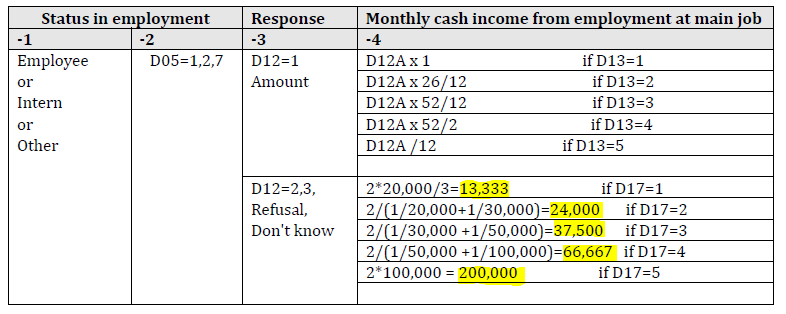

# Deriving employment variables

This section offers a comprehensive overview of the coding process for key employment variables, namely labor status, labor underutilization measures, and wages. It provides detailed explanations for each variable, starting with a description of the characteristics that differentiate the employed, unemployed, and those not in the labor force. The section then goes on to define those who fall into the potential labor force and underemployment categories. Lastly, it delves into the complexities of coding wage information, including the assumptions that underpin this process and describes the extent it may impact the accuracy of wage estimates.

## Labor status

### Employment

The employed are composed of people who have any of the following characteristics:

- Engaged in wage employment for at least an hour in the past 7 days

- Ran a business but not in agriculture

- Worked in agriculture with produce mostly for sale

- Engaged in unpaid work not in agriculture

- Engaged in unpaid work in agriculture with produce mostly for sale

- Did not work in the past 7 days due to sick leave, public holiday, annual leave, or maternity or paternity leave

- Did not work in the past 7 days due to other reasons, except seasonal work, and on leave for less than 3 months

- Did not work in the past 7 days due to other reasons, except seasonal work, and on leave for more than 3 months but continued to receive income

### Unemployment

The unemployed are composed of people who have any of the following characteristics:

- Engaged in active job search and would have started if the job becomes available

- Not looking for work because he/she has already found a job but still available to work

### Not in the labor force

Those not in the labor force are all others aged above 14 who do not fit the characteristics described for employed or unemployed.

## Labor underutilization measures

### Potential labor force

Those in the potential labor force include all individuals who are not in the labor force but possess any of the following characteristics

- Engaged in active job search but not available for work

- Wants a job and available to work but did not engage in active job search

- Not looking for work and have already found a job, but not available to work

- Not looking for work, have not found a job, but wants a job and available to work

### Underemployment

The underemployed include all individuals who are employed and possess any of the following characteristics

- Looked for other jobs and would take that job if it becomes available
- Did not look for other jobs but would want to take more hours if it becomes available

## Wage

There underlying earnings variables vary across the surveys. In 2017 and 2020, earnings data are available for both wage earners (cash and in-kind) and self-employed. However, in 2018 and 2021, data is only available for wage earners, and cash earnings are the only type available in 2018. Unfortunately, in 2019, there are no earnings data available for any of the employed.

There are some complications in combining data when there different sources of income.
- In cases where respondents received both cash and in-kind earnings, and the time frames for each varied, the time frame for cash earnings was used as the standard. In-kind earnings were then converted to the same time frame as the cash earnings. For instance, if an individual reported receiving cash earnings on a monthly basis and in-kind earnings on a daily basis, the in-kind earnings were imputed in months by multiplying the daily in-kind earnings by 30.

  It is worth noting that this approach could potentially result in overestimation of the estimates. However, the number of respondents who reported both in-cash and in-kind earnings at different time frames was minimal. At most, this possibility may occur to only up to 0.9% of wage respondents. 

| **Year** | **# reporting different time frames** | **# reporting wage** | **% of sample** |
|:---:|:---:|:---:|:---:|
| 2017 | 136 | 14,880 | 0.9% |
| 2018 | Data is only available for cash | 14,781 | NA |
| 2019 | NA | NA | NA |
| 2020 | 45 | 11,080 | 0.4% |
| 2021 | 29 | 13,718 | 0.2% |

- In cases where wage workers were unable to provide an exact income value and instead reported a range of values, the Rwanda National Institute of Statistics (NIS) assigned a specific value to the reported income range. The table below displays the assumed values (highlighted) for each income range indicated by the variable D17.

   

  It was found that the proportion of respondents with imputed income values, as a percentage of all respondents who reported wage earnings goes as high as 10% in 2018. However, this proportion was cut to half in the more recent surveys (see frequency table below).

| **Year** | **# reporting imputed wage** | **# reporting wages** | **% of sample** |
|:---:|:---:|:---:|:---:|
| 2017 | 1,291 | 14,880 | 9% |
| 2018 | 1,419 | 14,781 | 10% |
| 2019 | NA | NA | NA |
| 2020 | 578 | 11,080 | 5% |
| 2021 | 877 | 13,718 | 6% |

